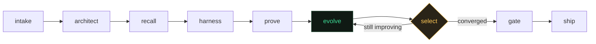

# Journeyman

**An AI engineer that builds it, proves it on data it has not seen, and remembers what worked.**

Built with the [Strands Agents SDK](https://strandsagents.com/) for the Agents for
Humans hackathon. Track: **Professional Agents**.

A journeyman is a qualified tradesperson who works *beside* you rather than for
you. That is the intent: this is not a chatbot you ask about AI engineering. It
does the job, produces the artifacts, and hands you the evidence.

---

## The problem

An AI engineer's day is not writing prompts. It is three harder things:

1. **Choosing the architecture.** Most of the cost of a bad agent system is paid
   the moment someone reaches for multi-agent orchestration on a problem that
   needed one function call, or reaches for RAG when there is no corpus.
2. **Knowing whether it works.** Almost nobody has an eval set, because building
   one is more work than building the thing. So people ship on feel, tweak on
   feel, and regressions land silently.
3. **Not relearning the same lesson.** The date-parsing bug you fixed in March is
   the same bug in September, in a different repo.

Journeyman does all three, end to end, and writes down what it learned.

## What it does

```bash
journeyman build "extract vendor, date and total from these invoices and prove it works"
```

A nine-node Strands graph runs:

| node | what it does |
|---|---|
| `intake` | reads the goal, works out what actually exists to build with |
| `architect` | picks the pattern, **and names the ones it rejected and why** |
| `recall` | looks for prior jobs like this one and what worked on them |
| `harness` | builds the eval set and splits off a held-out half |
| `prove` | measures the starting point and clusters the failures into sentences |
| `evolve` | one generation: target the worst cluster, mutate, measure. **This node runs once per generation.** |
| `select` | keep going, or stop. A conditional edge back to `evolve`. |
| `gate` | first and only look at the held-out half |
| `ship` | writes the artifact, the eval set, a CI regression gate, and the lessons |

You get back working code, the eval set it was measured on, a pytest regression
gate for CI, and a report showing every candidate it tried and rejected.

## The three things that make it different

### 1. It tells you what it did not build, and why

Choosing a pattern is easy. Ruling one out is the judgement.

```
    chose    Structured extraction
    chose    Verification and validation
    not      Direct model call: the task needs current or private data the model cannot know
    not      Tool use: there is only ever one action: just call it directly
    not      Planning and decomposition: the steps are always the same: hard-code
             the sequence, it is cheaper and more reliable
```

Ask it to answer questions over documents you do not have, and it rules out RAG
rather than building a retrieval pipeline over an empty corpus. That rule-out is
a test, not a claim (`test_architect_rules_out_rag_when_there_is_no_corpus`).

### 2. It reports the number you will actually get

The eval set is split once. The search never reads the held-out half. At the end
the surviving generations are scored on it and the one that *holds up* ships.

```
    before  ###################.........  68.7%
     after  ############################  100.0%

    Both measured on the half of the eval set the search never saw.
```

If the best training score does not survive held-out, it is reported as
overfitting and rejected. If nothing beats what you already had, it says so:

> No reliable improvement. Nothing found beat what you already had on data it has
> not seen, so keep what you have.

That refusal is a test too (`test_no_improvement_is_reported_as_no_improvement`),
as is the gate catching a candidate that scores by memorising the eval cases,
which is a documented failure mode of model-driven optimisation.

### 3. It gets measurably cheaper the more you use it

Same job, run twice. The second time it recalls the repairs that worked on a
similar task, **verifies each one still works**, and skips the rest of the search.

| | candidates measured | held-out result |
|---|---|---|
| first run, cold | **9** | 100% |
| second run, related task | **3** | 100% |

Nothing is taken on trust. A recalled repair is scored like any other candidate
before it is accepted; memory changes the *order* of the search, not the standard
of evidence. `test_memory_reduces_the_number_of_candidates_measured` asserts both
halves: less work, no loss of accuracy.

## The evolution loop is a cycle in the graph

Not a `for` loop inside a node.



```python
b.add_edge("select", "evolve", condition=lambda s: job.keep_evolving)
b.add_edge("select", "gate",   condition=lambda s: not job.keep_evolving)
b.reset_on_revisit(True)
b.set_max_node_executions(60)
```

One `evolve` execution is one generation, so the loop is visible in
`execution_order` and bounded by the SDK rather than by a counter you have to
trust. A real run:

```
intake -> architect -> recall -> harness -> prove
  -> evolve -> select -> evolve -> select -> evolve -> select -> evolve -> select
  -> gate -> ship
```

Both edge conditions read a value computed in Python, not text a model wrote.


## It works when you are not there

Everything above is Journeyman doing a job you asked for. This part is it
working the queue on its own.

```bash
journeyman scout                 # what is worth doing in this repo right now
journeyman shift                 # take the top item, work it, report
journeyman watch --max-shifts 6  # keep going until the queue is empty
```

A shift is: survey the repo, take the most important broken thing, work it in an
isolated git worktree until the tests pass, commit to a branch, write a report,
stop. You come back to a branch and a note.

```
  FIXED   failed: test_twenty_five_percent_off_eighty
          tests/test_invoices.py

  brain     qwen3-coder:30b
  branch    journeyman/20260913-1513-failed--test-twenty-five-percent-off-eig
  commit    bfbe21d
  tests     green
  took      0.4 min
  budget    2/120 commands, 0/6 heavy calls

  changed:
    billing/invoices.py

  Review it:  git diff main..journeyman/20260913-1513-...
```

That run is real. Two genuine bugs, fixed on the local model, in 24 seconds:

```diff
-    return round(amount - percent, 2)
+    return round(amount - (amount * percent / 100), 2)

-    share = round(total / people, 2)
-    return [share] * people
+    share = total / people
+    parts = [round(share, 2)] * (people - 1)
+    # Add the last part which makes up for any rounding difference
+    parts.append(round(total - sum(parts), 2))
+    return parts
```

It did not touch the tests. That is not luck, it is checked: the shift re-runs
the suite itself afterwards rather than believing the agent's claim, and the
commit only happens if that independent run is green.

### It proposes, you dispose

The contract, enforced in `guardrails.py` rather than requested in a prompt:

| | |
|---|---|
| Works in | a throwaway `git worktree` on a new branch |
| Never touches | your checkout, your branch, your stash |
| Never runs | `push`, `merge`, `reset`, `rebase`, `rm -rf`, `sudo`, `pip install`, anything piping a download into a shell |
| Cannot write | outside the sandbox, or to `.env`, `.pem`, `.key` |
| Stops at | 45 min, 12 files, 120 commands, 8 iterations, 6 paid-model calls |
| Stands down when | two consecutive shifts change nothing |
| Leaves you | a branch, a diff, and a report |

Every one of those refusals is a test. `test_autonomy.py` asserts that
`git push --force`, `rm -rf ~/Documents`, `curl … | sh`, `pip install`,
`chmod 777`, and working on `main` are all refused, and that the user's checkout
is byte-for-byte unchanged after a shift writes to the same file.

### How it finds work without being asked

`scout.py` is deterministic inspection. No model decides what is broken, so the
queue is auditable and identical on any machine.

| priority | source |
|---|---|
| 100 | failing tests, run with the project's own interpreter |
| 80 | unchecked boxes in `BACKLOG.md` |
| 60 / 40 | `FIXME` / `TODO` comments with actual text |
| 25 | public functions whose name appears nowhere in the tests |

## The brains

Two, because one is not enough and three is fuss.

| | model | where | when |
|---|---|---|---|
| **local** | Qwen3-Coder 30B-A3B (MoE, ~17 GB at Q4) | your laptop, via Ollama | everything routine. Free, private, works on a plane |
| **heavy** | [Kimi K3](https://github.com/MoonshotAI/Kimi-K3) (2.8T params, 1M context) | an OpenAI-compatible endpoint | when the local model is out of its depth, or the task needs the whole repo in view |

```bash
ollama pull qwen3-coder:30b            # the local brain
export OPENROUTER_API_KEY=...          # optional: enables Kimi K3
journeyman brain                       # check what is available
```

**On running Kimi K3 locally: you cannot.** At MXFP4 the weights are on the
order of a terabyte. A 24 GB laptop is off by roughly two orders of magnitude.
Using it through an API is still using an open-weight model, you can audit it,
self-host it on real hardware, and change provider without changing the code.
`brain/models.py` says this in the docstring so nobody discovers it at 2am.

Escalation is explicit and metered. The agent asks for the heavy brain, the
reason is written to the report, and the call budget is a hard stop. With no key
set, it does the whole job on the local model and says so.

## Run it

Python 3.10+. **No AWS account needed, and no API key needed either.**

```bash
git clone https://github.com/Naseeruddeen634/journeyman && cd journeyman
python -m venv .venv && .venv/bin/pip install -r requirements.txt
.venv/bin/python demo/generate.py
.venv/bin/python -m pytest -q                  # 18 passed

.venv/bin/python -m journeyman.cli build \
  "extract vendor, date and total from messy invoices and prove it is accurate"

.venv/bin/python -m journeyman.cli build \
  "pull supplier, date and amount total out of messy purchase orders and prove it works"

.venv/bin/python -m journeyman.cli memory      # what it has learned

# and the unattended side
ollama pull qwen3-coder:30b
.venv/bin/python -m journeyman.cli scout
.venv/bin/python -m journeyman.cli shift
```

Run the second command and watch the candidate count drop from 9 to 3.

## Why the numbers are trustworthy

The demo corpus in `demo/generate.py` is built **backwards**: start from
structured records, render them into messy documents, keep the records as the
answer key. Ground truth is exact by construction and nothing is graded by a
language model. The traps are real ones: six date formats including day-first and
pre-2000, European `1.234,56` amounts, a `Subtotal` line above the real `Total`
(where "total" is a substring of "subtotal"), invoices with no PO where the right
answer is nothing, and an account number that is the largest figure on the page.

## Built on

- **[Strands Agents SDK](https://strandsagents.com/)** — `GraphBuilder` with a
  cyclic topology and conditional edges, the `AgentBase` protocol for
  deterministic nodes, `reset_on_revisit`, execution bounds.
- **Architecture taxonomy** adapted from
  [30 Agents Every AI Engineer Must Build](https://github.com/PacktPublishing/30-Agents-Every-AI-Engineer-Must-Build)
  (Packt), which is where the pattern list and the production concerns come from.
- **Self-evolution framing** from
  [EvoAgentX](https://github.com/ANative-Lab/EvoAgentX): generate, execute,
  evaluate, optimise, repeat. EvoAgentX optimises against existing benchmarks
  such as HotPotQA and MBPP. Journeyman's difference is that it manufactures the
  measurement for a task that has none, and holds half of it back.

### Prior art, named on purpose

Prompt and workflow optimisation is a crowded field and this README is not going
to pretend otherwise. [DSPy](https://dspy.ai/) (MIPROv2, GEPA) does reflective
failure diagnosis and held-out validation.
[promptfoo](https://www.promptfoo.dev/), [DeepEval](https://deepeval.com/),
Braintrust and Langfuse all ship synthetic eval generation and CI gating. AWS
ships [`strands-agents-evals`](https://github.com/strands-agents/evals), whose
`ExperimentGenerator` creates test suites from a context description.

What Journeyman puts together that those do not: architecture selection with
explicit rejections, the held-out result as the reported number rather than the
training score, and a memory that makes the next similar job measurably cheaper.
If you already have an eval set and a metric, use DSPy. This is for the much more
common case where you have neither.

## What it does not do

It evolves a Python artifact against a deterministic grader. It does not yet
optimise free-text prompts graded by a model, it will not rescue a task with no
checkable notion of correct, and the pattern library is a fixed set of twelve
architectures rather than anything open-ended.

On the unattended side: it fixes the kind of bug a failing test pins down
precisely. It is not going to design your service. Work it cannot do comes back
as `STUCK` with an account of what it tried, which is the correct outcome and
happens regularly. It reads Python; other languages are a scout change away but
are not there today.

The honest summary: it does a few kinds of engineering job properly rather than
every kind badly, and it tells you which is which.

## Licence

MIT. Built by [Naseeruddeen Shahul Hameed](https://github.com/Naseeruddeen634).
